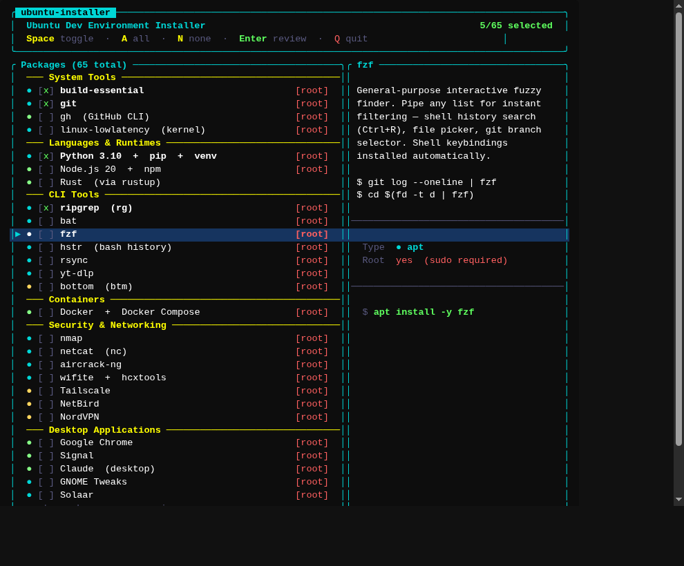
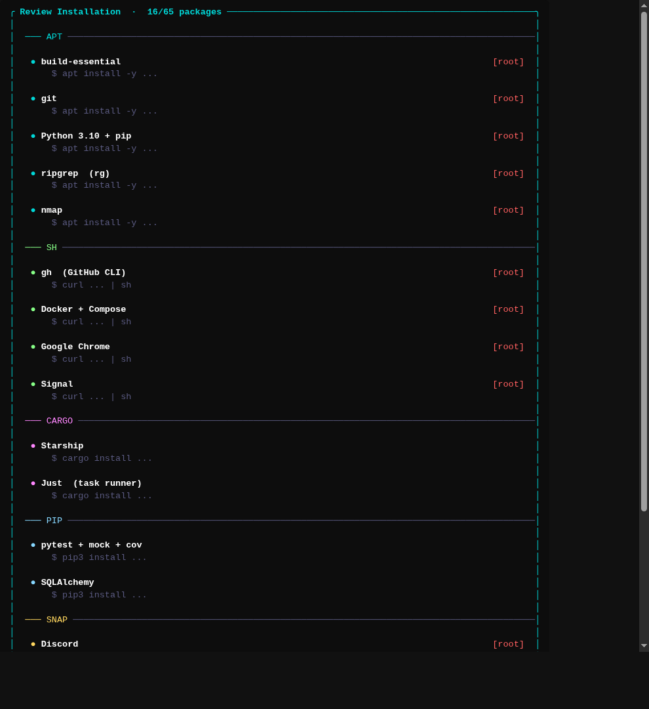

# Linux Warez List

> Comprehensive inventory of software, tools, and configurations for an Ubuntu 22.04 LTS development machine.

Complete breakdown of every dev tool, CLI utility, desktop application, extension, and font for an Ubuntu 22.04 LTS dev environment.

## Contents

| Name | Description |
|------|-------------|
| `installer` | Interactive TUI installer — run this (pre-built, Linux x86-64) |
| `install-all.sh` | Headless script that installs everything automatically |
| `LINUX_WAREZ_LIST.md` | Full software inventory with descriptions and install commands |
| `gather-software-inventory.sh` | Dumps a JSON snapshot of installed packages for backup/diffing |

---

## Interactive Installer (recommended)

A Rust TUI that lets you browse all 40 packages by category, read descriptions, and check off exactly what you want before anything touches your system.

```bash
# Run the pre-built binary (sudo needed for apt/snap/docker packages)
sudo ./installer
```

Or build from source:

```bash
cd installer-tui
cargo build --release
sudo ./target/release/installer-tui
```

### Controls

| Key | Action |
|-----|--------|
| `↑` / `↓` or `j` / `k` | Navigate the list |
| `Space` | Toggle a package on/off |
| `A` | Select all |
| `N` | Deselect all |
| `PgUp` / `PgDn` | Jump 10 items |
| `Enter` | Review selected packages |
| `B` / `Esc` | Go back to the list |
| `Q` | Quit |

### What it looks like

**Package selection screen** — browse all 40 packages by category, read descriptions, and toggle what you want:



**Review screen** — see everything you've selected grouped by install method before anything touches your system:



Package rows are color-coded by install method:
- **Cyan** `●` — `apt` package
- **Green** `●` — shell script (curl installer)
- **Magenta** `●` — `cargo install`
- **Blue** `●` — `pip3 install`
- **Yellow** `●` — `snap install`

---

## Headless Install (install everything)

```bash
sudo bash install-all.sh
```

Installs the full stack unattended. Useful for provisioning a fresh machine where you want everything.

---

## Packages (40 total)

### System Tools
| Package | Method |
|---------|--------|
| build-essential | apt |
| git | apt |
| gh (GitHub CLI) | script |

### Languages & Runtimes
| Package | Method |
|---------|--------|
| Python 3.10 + pip + venv | apt |
| Node.js 20 + npm | script |
| Rust (via rustup) | script |
| GCC + G++ + GDB | apt |
| Clang + LLVM | apt |

### CLI Tools
| Package | Method |
|---------|--------|
| ripgrep (rg) | apt |
| fd | script |
| direnv | apt |
| jq | apt |
| SQLite3 | apt |
| make | apt |
| CMake | apt |
| Valgrind | apt |
| bat | apt |
| Watchman | apt |
| FFmpeg | apt |
| ImageMagick | apt |

### Containers
| Package | Method |
|---------|--------|
| Docker + Docker Compose | script |

### Terminal & Shell
| Package | Method |
|---------|--------|
| bash-completion | apt |
| GNOME Terminal | apt |

### Rust Tools
| Package | Method |
|---------|--------|
| Starship (shell prompt) | cargo |
| Just (task runner) | cargo |

### Python Packages
| Package | Method |
|---------|--------|
| pytest + pytest-mock + pytest-cov | pip |
| SQLAlchemy | pip |
| Pydantic + pydantic-settings | pip |
| black | pip |
| flake8 | pip |
| mypy | pip |
| requests | pip |

### Fonts
| Package | Method |
|---------|--------|
| fonts-liberation | apt |
| fonts-dejavu | apt |
| FiraCode Nerd Font | script |

### Snap Applications
| Package | Method |
|---------|--------|
| Discord | snap |
| Slack | snap |
| Spotify | snap |
| Notion | snap |
| NordPass | snap |

### Desktop Applications
| Package | Method |
|---------|--------|
| SimpleScreenRecorder | apt |
| VeraCrypt | apt |

---

## System Info

- **OS:** Ubuntu 22.04 LTS (Jammy Jellyfish)
- **Primary Editor:** Cursor
- **Shell:** Bash + Starship prompt
- **Deployment:** Local / self-hosted only

## Tech Stack

- Python 3.10 (primary)
- C/C++ (embedded, RF security)
- JavaScript / Node.js
- Rust (systems tools)

## Workflow

- **Version Control:** Git + GitHub Flow
- **Testing:** pytest + pytest-mock
- **Data:** SQLAlchemy + SQLite
- **Config:** Pydantic
- **CI/CD:** GitHub Actions
- **Build:** Make, CMake, Just

---

## Post-Install Steps

1. Log out and back in after installing Docker (group permissions)
2. Run `gh auth login` to authenticate the GitHub CLI
3. Add to `~/.bashrc` after installing Starship: `eval "$(starship init bash)"`
4. Add to `~/.bashrc` after installing direnv: `eval "$(direnv hook bash)"`
5. Download [Cursor](https://www.cursor.com/) (not in apt)
6. Set your terminal font to **FiraCode Nerd Font** after installing it (installer handles the download)
7. Configure `~/.config/starship.toml` to taste

## Updating Tools

```bash
# apt packages
sudo apt update && sudo apt upgrade

# Python packages
pip install --upgrade <package>

# Rust tools
cargo install --force <tool>

# npm globals
npm install -g <package>
```

---

## License

Public reference — customize as needed for your environment.

**Last Updated:** 2026-04-02
