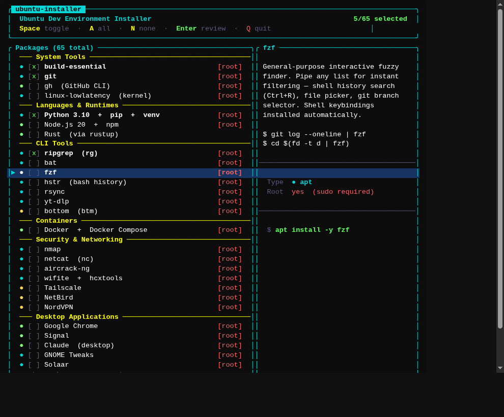
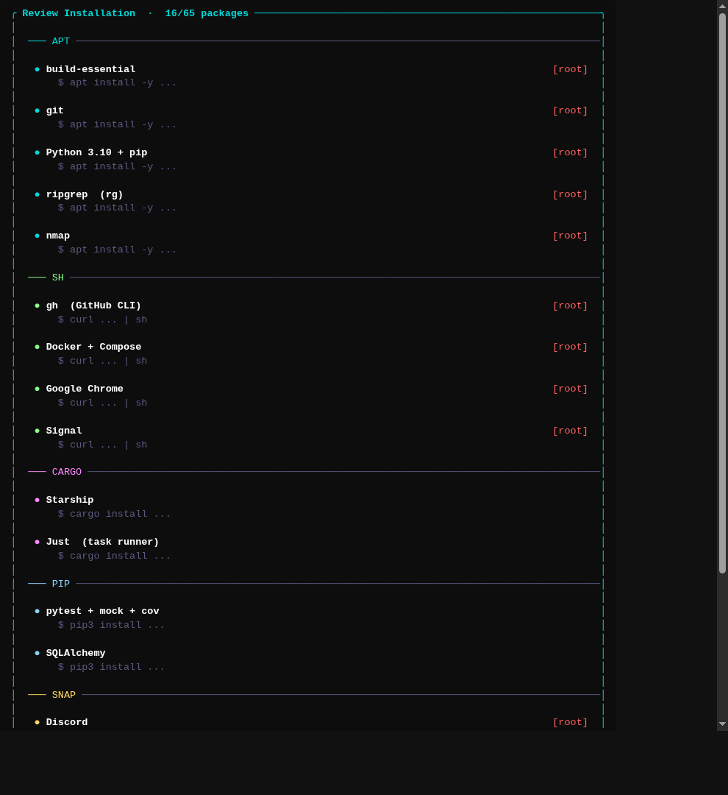

# linux-warez-list

> Complete Ubuntu dev environment — 108 packages, extensions, and tools across system tools, languages, CLI utilities, security, and desktop apps. Pick exactly what you want with an interactive TUI or run the headless script to install everything.

---

## Quick Start

```bash
# Interactive TUI (recommended)
sudo ./installer

# Or install everything unattended
sudo bash install-all.sh
```

> Requires Ubuntu 22.04 LTS (x86-64). Run with `sudo` to unlock all packages.

---

## Interactive Installer

A Rust TUI built with [ratatui](https://github.com/ratatui-org/ratatui). Browse all 108 packages, extensions, and tools by category, read descriptions, and toggle exactly what you want — nothing runs until you confirm.

### Package selection

Browse categories, read descriptions on the right, and toggle packages with `Space`. Packages requiring `sudo` are locked and dimmed if the installer isn't run as root.



### Review before installing

Hit `Enter` to review everything you've selected, grouped by install method, before anything touches your system.



### Controls

| Key | Action |
|-----|--------|
| `↑` / `↓` or `j` / `k` | Navigate |
| `Space` | Toggle package on/off |
| `A` | Select all (unlocked) |
| `N` | Deselect all |
| `PgUp` / `PgDn` | Jump 10 rows |
| `Enter` | Review selected packages |
| `B` / `Esc` | Back to list |
| `Q` | Quit |

Package rows are colour-coded by install method:

| Colour | Method |
|--------|--------|
| **Cyan** `●` | `apt` |
| **Green** `●` | shell script |
| **Magenta** `●` | `cargo install` |
| **Blue** `●` | `pip3 install` |
| **Yellow** `●` | `snap install` |

---

## Packages (84 total)

### System Tools
| Package | Method |
|---------|--------|
| build-essential | apt |
| git | apt |
| gh (GitHub CLI) | script |
| linux-lowlatency (kernel) | apt |
| snapd | script |
| curl | apt |
| wget | apt |
| unzip | apt |

### Languages & Runtimes
| Package | Method |
|---------|--------|
| Python 3.10 + pip + venv | apt |
| Node.js 20 | script |
| npm (latest) | script |
| Bun | script |
| Rust (via rustup) | script |
| GCC + G++ + GDB | apt |
| Clang + LLVM | apt |

### CLI Tools
| Package | Method |
|---------|--------|
| ripgrep (rg) | apt |
| fd | script |
| direnv | apt |
| jq | apt |
| SQLite3 | apt |
| make | apt |
| CMake | apt |
| Valgrind | apt |
| bat | apt |
| Watchman | apt |
| FFmpeg | apt |
| ImageMagick | apt |
| fzf | apt |
| hstr | apt |
| rsync | apt |
| zstd | apt |
| detox | apt |
| yt-dlp | apt |
| htop | apt |
| tree | apt |
| strace | apt |
| ShellCheck | apt |
| duf | apt |
| ncdu | apt |
| xclip | apt |
| pipx | apt |
| lazygit | script |
| bottom (btm) | script |

### Containers
| Package | Method |
|---------|--------|
| Docker + Docker Compose | script |

### Security & Networking
| Package | Method |
|---------|--------|
| nmap | apt |
| netcat (nc) | apt |
| aircrack-ng | apt |
| wifite + hcxtools | apt |
| Tailscale | script |
| NetBird | script |
| NordVPN | script |
| OpenSSH Server (sshd) | apt |
| net-tools | apt |
| WireGuard Tools (wg) | apt |

### Terminal & Shell
| Package | Method |
|---------|--------|
| bash-completion | apt |
| GNOME Terminal | apt |
| tmux | apt |

### Rust Tools
| Package | Method |
|---------|--------|
| Starship (shell prompt) | cargo |
| Just (task runner) | cargo |
| rust-analyzer (LSP) | rustup component |

### Python Packages
| Package | Method |
|---------|--------|
| pytest + pytest-mock + pytest-cov | pip |
| SQLAlchemy | pip |
| Pydantic + pydantic-settings | pip |
| black | pip |
| flake8 | pip |
| mypy | pip |
| requests | pip |

### Fonts
| Package | Method |
|---------|--------|
| fonts-liberation | apt |
| fonts-dejavu | apt |
| FiraCode Nerd Font | script |

### Claude & AI Tools
| Tool | Method |
|------|--------|
| Claude Desktop | apt |
| Claude Code (CLI) | npm |
| Claude in Chrome (extension) | manual |
| Compound Engineering Plugin | manual |
| jcodemunch-mcp (MCP server) | pip/uvx |
| memory MCP (local server) | script |
| Gmail MCP | cloud |
| Google Calendar MCP | cloud |
| Google Drive MCP | cloud |
| Notion MCP | cloud |

### GNOME Shell Extensions
| Extension | Status |
|-----------|--------|
| Ubuntu Dock | enabled |
| Ubuntu AppIndicators | enabled |
| Desktop Icons NG (DING) | enabled |
| Just Perfection | enabled |
| OpenWeather | enabled |
| TopHat | enabled |
| Freon | enabled |
| Net Speed Simplified | enabled |
| Audio Selector | enabled |
| Bluetooth Quick Connect | enabled |
| Simple Message | disabled |

### Snap Applications
| Package | Method |
|---------|--------|
| Notion | snap |
| NordPass | snap |

### Desktop Applications
| Package | Method |
|---------|--------|
| Spotify | apt |
| Obsidian | script |
| Discord | script |
| Slack | script |
| SimpleScreenRecorder | apt |
| VeraCrypt | apt |
| NoMachine | script |
| GNOME Tweaks | apt |
| GNOME Shell Extension Manager | apt |
| GRUB Customizer | script |
| Solaar | apt |
| Meld | apt |
| Peek | apt |
| Google Chrome | script |
| Signal | script |
| Claude (desktop) | script |

---

## Build from Source

Requires Rust (stable).

```bash
cd installer-tui
cargo build --release
sudo ./target/release/installer-tui
```

To update the pre-built `installer` binary after making changes:

```bash
cp installer-tui/target/release/installer-tui installer
chmod +x installer
```

---

## Repo Contents

| File | Description |
|------|-------------|
| `installer` | Pre-built TUI binary (Linux x86-64, run directly) |
| `install-all.sh` | Headless script — installs everything unattended |
| `LINUX_WAREZ_LIST.md` | Full inventory with descriptions and install commands |
| `gather-software-inventory.sh` | Dumps a JSON snapshot of installed packages |
| `software-inventory.json` | Current machine snapshot |
| `installer-tui/` | Rust source for the TUI |

---

## Post-Install

1. **Docker** — log out and back in after install for group permissions to take effect
2. **GitHub CLI** — run `gh auth login` to authenticate
3. **Starship** — add to `~/.bashrc`: `eval "$(starship init bash)"`
4. **direnv** — add to `~/.bashrc`: `eval "$(direnv hook bash)"`
5. **hstr** — add to `~/.bashrc`: `eval "$(hstr --show-configuration)"`
6. **FiraCode Nerd Font** — the installer sets it as the system monospace font automatically
7. **Tailscale** — run `sudo tailscale up` after install, then authenticate via the printed URL
8. **NordVPN** — run `nordvpn login` then `nordvpn connect`

---

## Updating

```bash
# apt packages
sudo apt update && sudo apt upgrade

# Rust tools
cargo install --force starship just

# Python packages
pip install --upgrade black flake8 mypy pytest

# Snap packages
sudo snap refresh
```

---

**Last Updated:** 2026-05-30
